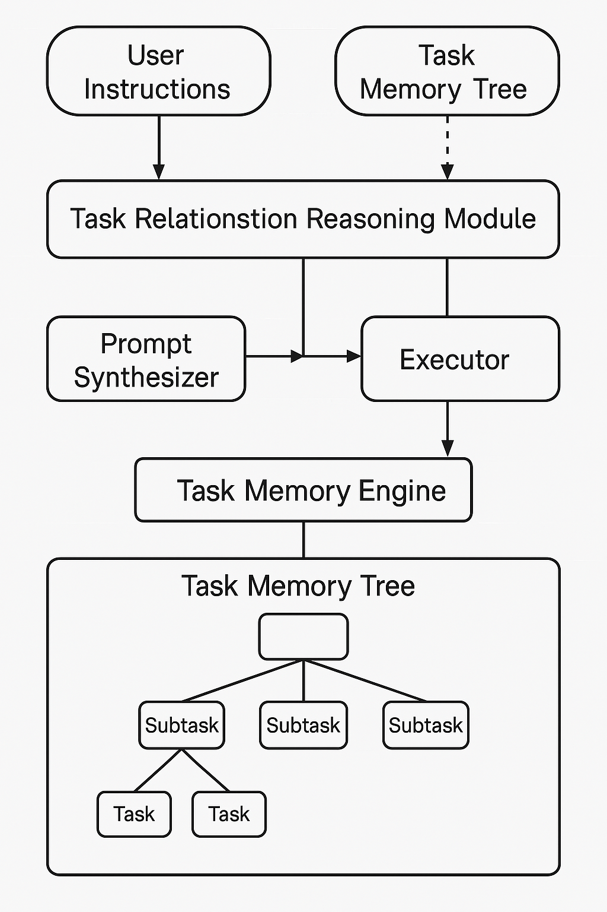

# 🧠 Task Memory Engine (TME)

TME is a structured memory engine designed for LLM-based agents to perform **multi-step task planning**, **rollback**, **dynamic preference adjustment**, and **reasoning** between tasks.

> 📄 Paper: *Task Memory Engine: Structured Agent Memory for Multi-step Reasoning*  
> 🧑‍💻 Author: [@biubiutomato](https://github.com/biubiutomato)  
> 📦 Version: `v1.0` (core modules ready)  
> 📘 License: [Polyform Noncommercial 1.0.0](./LICENSE)

---

## 🚧 Project Status: Actively Developing

This is the initial release of **Task Memory Engine (TME)** — the core modules are ready and functional 🎉  
We are currently working on the next major update featuring **DAG-based memory modeling** to support more flexible, non-linear task structures.

📣 If you find this project helpful, please consider **starring**, **forking**, or **sharing** it!  
Citation info and `Citation.bib` will be added after the arXiv version is published.

For feedback or collaboration opportunities, reach out at [biubiutomato@gmail.com](mailto:biubiutomato@gmail.com).

---

## 🏗️ System Architecture



---

## 🔧 Key Features

- ✅ **Task Memory Tree (TMT)** — hierarchical structured task tracking  
- 🔁 **Rollback & Re-routing** — replan from any subtask  
- 🧠 **Task Reasoning** — detect dependency / replacement / parallel branches  
- ✏️ **Prompt Synthesizer** — auto-generate subtasks from TMT  
- 🪢 **Execution Feedback Loop** — enable history-aware retry

---

## 📁 Repository Structure

```bash
tme-agent/
├── LICENSE
├── README.md
├── assets/
│   └── tme_architecture.png
├── tme/
│   ├── memory_tree.py
│   ├── reasoning.py
│   └── executor.py
└── examples/
    ├── trip_ChatGPT.py
    ├── trip_TEM.py
    ├── formfilling_ChatGPT.py
    └── formfilling_TEM.py
```

# TEM agent vs ChatGPT baseline
# example - form filling (temporarily mocked)
python examples/fillform_ChatGPT.py
python examples/fillform_TEM.py
more examples coming soon...

---

## 🚀 Quick Start

### 1. 📦 Install dependencies

```bash
pip install openai
```

(Optional: for `.env` support)
```bash
pip install python-dotenv
```

### 2. 🔐 Set your API Key

```bash
export OPENAI_API_KEY=your_key_here
```

Or create a `.env` file:
```env
OPENAI_API_KEY=your_key_here
```

---

## 🧪 Examples

### ➤ Travel Planner (multi-step destination planning)
Coming soon...

### ➤ Form Filling (guided assistant，temporarily using mock data)
```bash
python examples/formfilling_ChatGPT.py
python examples/formfilling_TEM.py
```

---

## 📄 License & Usage

This project is released under the **[Polyform Noncommercial License 1.0.0](https://polyformproject.org/licenses/noncommercial/1.0.0/)** — free for **academic and personal use only**.

> 💼 For commercial use, please contact the author directly for a license.  
> 📧 Contact: biubiutomato@gmail.com


